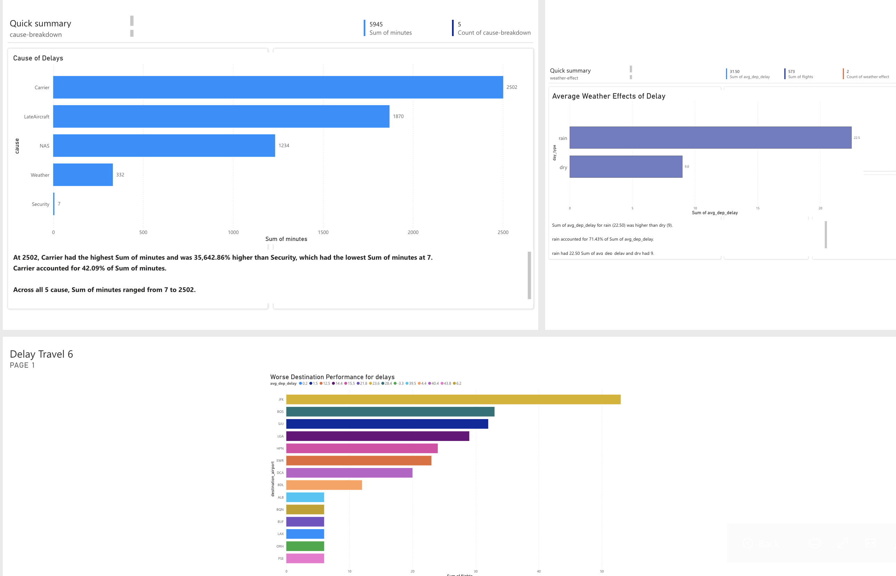
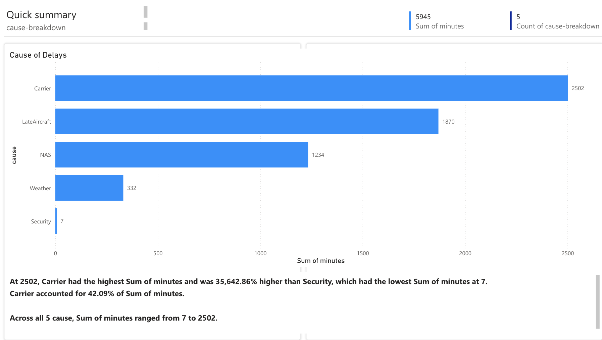
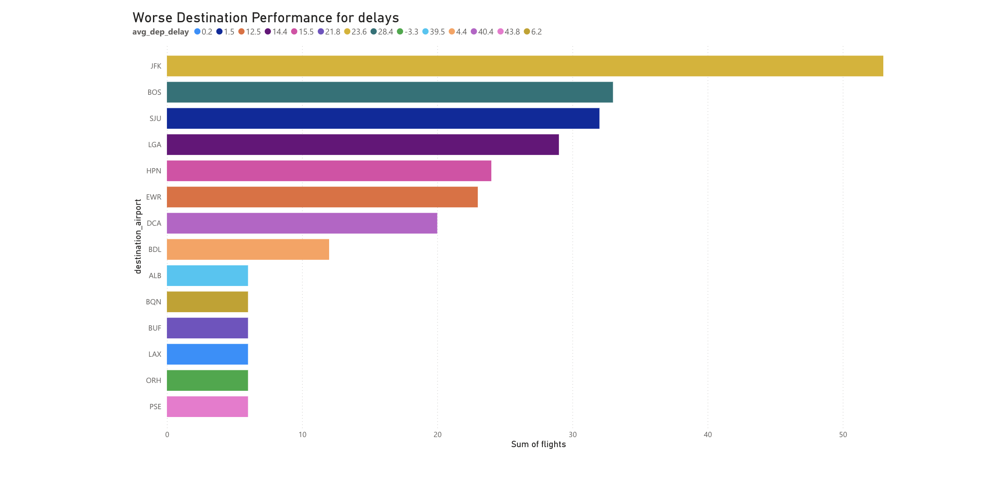
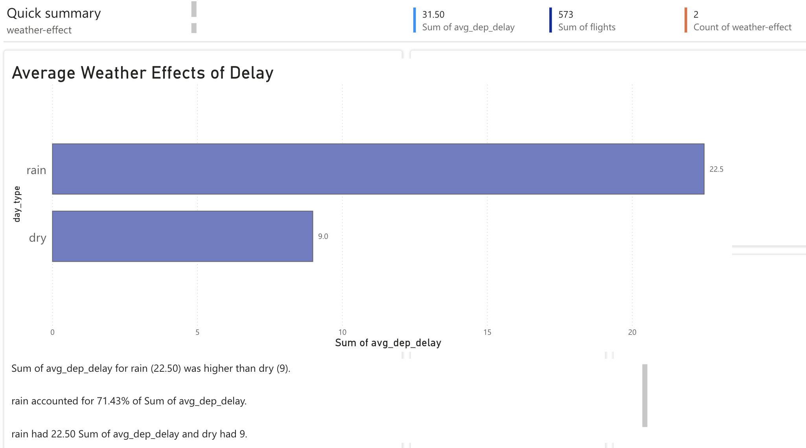

# Flight Delay & Route Risk — Python · MySQL · Power BI

> I built an end-to-end Flight Delay analytics pipeline for August 2024 using **Python (pandas)** to load CSVs into **MySQL**, modeled with **SQL views & indexes**, and visualized in **Power BI**. The dashboard explains which **carriers/routes/airports** are most delayed, and how **weather (rain vs. dry)** affects delays.

## What this is
An end-to-end analytics project ranking risky flight routes and explaining delay patterns with weather context.  
**Stack:** Python (pandas, SQLAlchemy) → MySQL (views + indexes) → Power BI.

## Key Questions Answered
- Which **carriers / routes / destinations** have the worst delays?
- How do delays **change month-over-month**?
- How much do **rainy days** add to delays?
- Which routes are **riskiest right now** (transparent risk score)?

## Findings (from this dataset)
> Overall Findings: [Findings](https://docs.google.com/document/d/1x1CzctyTnjW-9UJfnFmxuPn4l680V6rj2QbtMQwhToQ/edit?usp=sharing)
~

~
- Avg departure delay: 2502 min; 42.09% of flights delayed >15 min.

~
- Top 3 worst destinations by delay: JFK, BOS, SJU.

~
- **Rain days** had more delays overall.  


### Quick SQL to pull these numbers
```sql
-- Overall
SELECT ROUND(AVG(dep_delay_minutes),1) AS avg_delay_min,
       ROUND(AVG(dep_delay_minutes>15)*100,1) AS pct_delayed
FROM flights_raw;

-- Carrier ranking
SELECT carrier_code,
       COUNT(*) AS flights,
       ROUND(AVG(dep_delay_minutes),1) AS avg_delay_min
FROM flights_raw
GROUP BY carrier_code
ORDER BY avg_delay_min DESC
LIMIT 5;

-- Weather effect
SELECT CASE WHEN prcp>0 THEN 'rain' ELSE 'dry' END AS day_type,
       ROUND(AVG(dep_delay_minutes),1) AS avg_delay_min,
       COUNT(*) AS flights
FROM flights_with_weather
GROUP BY day_type;

-- Route/month risk (from the view)
SELECT * FROM route_summary ORDER BY risk_score DESC LIMIT 10;
```

## How it works
1) **Python ETL** (`delay.py`) — normalizes CSVs and loads to MySQL tables:
   - `flights_raw`, `weather_daily`
2) **MySQL modeling** — semantic layer for BI:
   - Indexes on `flight_date`, `carrier_code`, `destination_airport`
   - Views:
     - `flights_with_weather` → `flights_raw` + weather by date
     - `route_summary` → monthly rollup with flights, avg delay, % delayed, **risk_score**
       ```sql
       -- inside route_summary
       risk_score = 0.4 * AVG(dep_delay_minutes)
                  + 10 * AVG(CASE WHEN IFNULL(delay_weather_minutes,0) > 0 THEN 1 ELSE 0 END)
       ```
3) **Power BI dashboard** — KPIs, trends, risk ranking, carrier/route breakdowns.

## Reproduce locally
```bash
# 1) Database
mysql -u root -e "CREATE DATABASE IF NOT EXISTS flightdb;"

# 2) Python deps
pip install -r requirements.txt    # pandas, sqlalchemy, mysql-connector-python

# 3) Load data (uses env vars or defaults)
DB_USER=root DB_PASS='' DB_NAME=flightdb python3 delay.py

# 4) Build views & indexes
mysql -u root flightdb < views.sql
mysql -u root flightdb < indexes.sql
```

Open the `.pbix` and point to `flightdb`.

## Power BI Model & Measures
**Tables:** `flights_raw`, `weather_daily`, `flights_with_weather`, `route_summary`  
**Relationship:** `flights_raw[flight_date]` → `weather_daily[date]` (many-to-one)

**Core DAX (drop-ins):**
```DAX
Flights = COUNTROWS(flights_raw)

Avg Dep Delay (min) = AVERAGE(flights_raw[dep_delay_minutes])

Delayed Flights (>15m) =
CALCULATE([Flights], FILTER(flights_raw, flights_raw[dep_delay_minutes] > 15))

% Delayed = DIVIDE([Delayed Flights (>15m)], [Flights])

-- Weather impact (use flights_with_weather / alias as flw)
Avg Dep Delay (Rain) =
CALCULATE( AVERAGE(flw[dep_delay_minutes]), FILTER(flw, flw[prcp] > 0) )

Avg Dep Delay (Dry)  =
CALCULATE( AVERAGE(flw[dep_delay_minutes]), FILTER(flw, COALESCE(flw[prcp],0)=0) )

Rain Δ Delay (min) = [Avg Dep Delay (Rain)] - [Avg Dep Delay (Dry)]
```

## Repo structure
```
.
├── delay.py              # Python ETL → MySQL
├── views.sql             # flights_with_weather, route_summary
├── indexes.sql           # indexes for BI performance
├── exports/              # CSV outputs for quick peek
├── visuals/              # visuals for SQL outputs
└── README.md
```

## Assumptions & Limits
- Weather joined **by date** only (not by meteo-station proximity). Good for trend/context; not a causal model.
- Missing/malformed times are coerced to nulls; averages use available rows.
- Risk score is **interpretable**, not predictive; weights are tunable.
